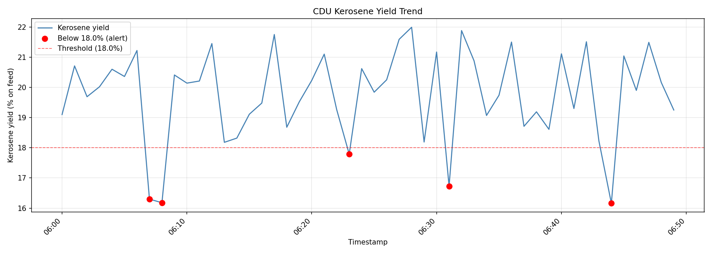

# Jamnagar CDU Optimisation — Tag Summary Tool

## What this project is

This project is a set of Python tools for analysing SCADA historian data from the Crude Distillation Unit (CDU) at Jamnagar refinery. The immediate goal is to monitor kerosene yield, flag low-yield events automatically, and build a foundation for ML-based optimisation of key control handles (COT, reflux ratio, overhead pressure, crude blend ratio).

## The problem it solves

Kerosene yield data sits in the historian at 1-minute resolution, but spotting low-yield periods across a shift or a multi-day run typically means manually scrolling through trends in the DCS or exporting to Excel. This script automates that process: one command reads the data, produces summary statistics for every tag, flags any minute where kerosene yield drops below threshold, and saves the results ready for investigation — without touching the historian directly.

---

## Project structure

```
refinery-project/
├── plant_data.csv          # Historian export (or synthetic test data)
├── tag_summary.py          # Main analysis script
└── results/                # All outputs land here (created automatically)
    ├── low_yield_alerts.csv
    └── yield_trend.png
```

---

## Input file: plant_data.csv

The script expects a CSV file with the following four columns. Column names must match exactly (case-sensitive).

| Column | Units | Typical range | Description |
|---|---|---|---|
| `timestamp` | YYYY-MM-DD HH:MM:SS | — | 1-minute historian timestamp |
| `COT_degC` | °C | 340 – 370 | Coil outlet temperature |
| `reflux_ratio` | — | 1.8 – 2.4 | Reflux ratio at the kerosene draw tray |
| `kerosene_yield_pct` | % on feed | 16 – 22 | Kerosene yield as a percentage of CDU feed rate |

To use your own historian export, rename or replace `plant_data.csv` with your file and ensure the column headers match the table above. The script will adapt automatically to however many rows are present.

---

## How to run the script

### One-time setup — installing Python and the required libraries

If Python is not already installed, download it from [python.org](https://www.python.org/downloads/). Then open a terminal (Mac/Linux) or Command Prompt (Windows) and run:

```
pip install pandas matplotlib
```

You only need to do this once.

### Running the script

1. Place `plant_data.csv` in the same folder as `tag_summary.py`.
2. Open a terminal, navigate to the project folder, and run:

```
python tag_summary.py
```

The script takes a few seconds and prints its output directly to the terminal. All files are saved to the `results/` folder automatically.

---

## What the script does

The script runs four steps in sequence:

**Step 1 — Load the data**
Reads `plant_data.csv` into memory and confirms how many rows and columns were loaded.

**Step 2 — Print summary statistics**
For every numeric tag, prints the mean, minimum, and maximum value across the entire dataset. Use this to quickly sense-check whether the data looks physically reasonable before doing any further analysis.

**Step 3 — Flag low-yield rows**
Scans every row and flags any minute where `kerosene_yield_pct` is below 18.0%. Reports the total count and percentage of flagged rows in the terminal.

**Step 4 — Save outputs**
Writes two files to the `results/` folder (see below).

---

## Outputs

### results/low_yield_alerts.csv

A CSV file containing only the flagged rows — every minute where kerosene yield fell below 18%. The columns are identical to the input file, so you can open it in Excel and immediately cross-reference the timestamp against DCS logs, lab results (LIMS), or shift handover notes to understand what was happening with COT or reflux at that moment.

### results/yield_trend.png

A line chart of kerosene yield across the full run. Low-yield events are shown as red dots so they are immediately visible. A dashed red horizontal line marks the 18% alert threshold for reference.

Example output:



---

## Changing the alert threshold

The alert threshold is set at the top of the script in a single line:

```python
YIELD_THRESHOLD = 18.0
```

Change `18.0` to any value and re-run. No other part of the script needs to be touched.

---

## Limitations and next steps

- The script analyses one CSV export at a time. It does not connect live to the historian.
- Only `kerosene_yield_pct` is used for alerting. Alerts on other tags (e.g. COT exceedances) can be added by following the same pattern in the script.
- Planned next step: build a regression model to quantify how changes in COT, reflux ratio, and crude blend ratio drive changes in kerosene yield, using this same dataset as training data.
